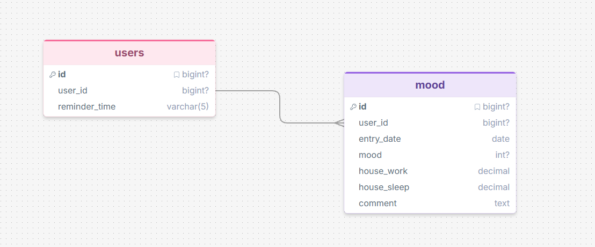

# Трекер настроения и продуктивности

Telegram-бот для ежедневного отслеживания настроения, часов работы и сна.

## Установка

```
pip install -r requirements.txt
```

## Запуск

```
python bot.py
```

## Команды

- /start — запуск и приветствие
- /add — записать день
- /stats — статистика
- /history — история записей
- /settings — время напоминания
- /clear — очистить данные
- /help — справка

## Структура

- `bot.py` — основной файл бота
- `db.py` — работа с базой данных
- `analyzer.py` — статистика и инсайты
- `schema.sql` — схема БД
- `test_data.sql` — тестовые данные

##Something

## Схема базы данных
